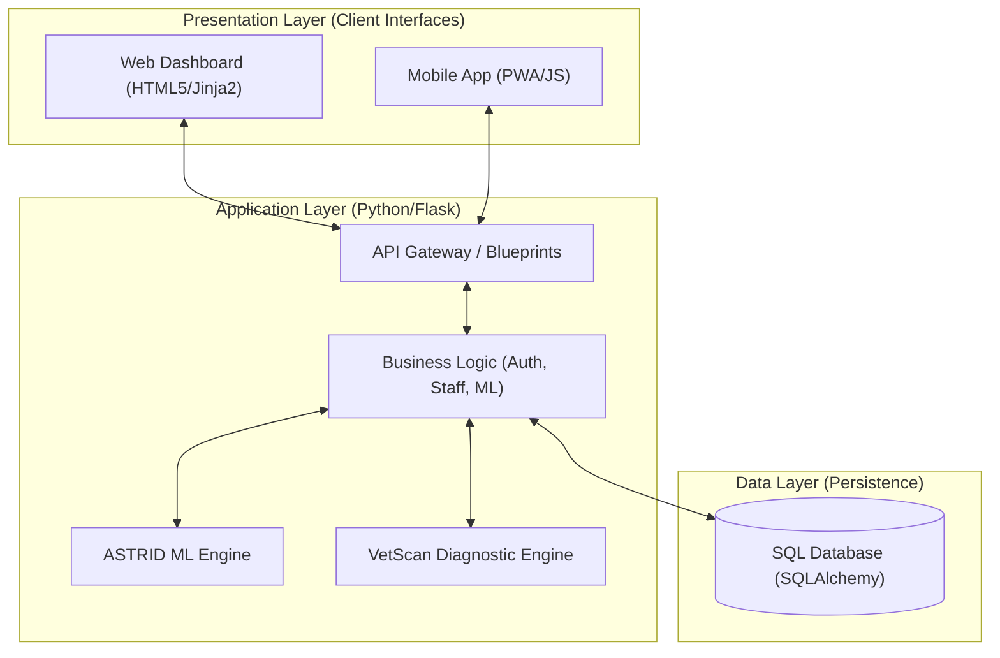

# VetSync Clinical Ecosystem: Technical Design Document
**Target Client/Industry:** Veterinary Healthcare Services
**Version:** 4.0 (Defense-Ready)

---

## 1. Executive Summary & Problem Definition
### The Problem
Traditional veterinary clinics face a significant operational challenge: **Fragmented Data Ecosystems**. Scheduling, medical history, and client communication are often managed across disjointed tools, leading to "module gaps," data silos, and a lack of real-time clinical visibility. This fragmentation increases the risk of clinical errors and administrative overhead.

### The Unified Solution
VetSync solves this by providing a single, seamless ecosystem built on a centralized **Python-based Blueprint architecture**. Instead of isolated web and mobile modules, VetSync utilizes a **"Core Service"** approach where both the Web interface and the Mobile Progressive Web App (PWA) consume a unified Flask-based API Gateway. This ensures that clinical data, status updates, and pet records are synchronized in real-time across the entire clinical environment with zero "module gaps."

---

## 2. System Integration & Architecture (SIA)
This section details the unified structural design of the VetSync ecosystem, ensuring high clinical reliability and data consistency.

### Architectural Pattern: RESTful API Gateway
VetSync utilize a **Modular RESTful API Architecture** organized through **Flask Blueprints**. Unlike traditional monolithic apps, VetSync operates as a **Centralized Service Hub**. 
*   **The API Gateway**: All client interfaces (Web and Mobile) communicate with a single Python-based gateway. This ensures that every transaction—whether a pet checkup record or a login attempt—passes through the same validation and business logic layer.

### The "One-System" Logic
The Web Dashboard and Mobile platforms are **not separate apps**; they are different views of the **same underlying system**. 
*   **Shared Infrastructure**: They share a single database instance and the same set of Python services.
*   **Real-Time Synchronization**: Because the PWA (Mobile) and the Staff Dashboard (Web) query the same endpoints, any update made by a vet on their desktop is instantly visible to the client on their phone. There is no "delay" or "manual sync" required.

### Constraint Check: Avoiding "Isolated Modules"
A critical architectural constraint in VetSync is the **elimination of module gaps**:
*   **No Local Mobile Database**: The mobile application does **not** have its own local database (no SQLite on the device side). This architectural choice explicitly prevents data silos.
*   **Single Source of Truth**: The system queries the **Python API Gateway** directly. If the server is updated, all platforms are updated simultaneously. This ensures the system is truly seamless with no discernible "module gaps" or version mismatches between clinical staff and pet owners.

### High-Level System Architecture Diagram

### Diagram Explanation
1.  **Presentation Layer**: This is the "User Interface" level. It consists of two distinct portals (Web and Mobile) that are built using responsive web technologies. They act as "dumb" interfaces that only display data and capture user input.
2.  **Application Layer (The "Brain")**: This is the core of VetSync. Built strictly in **Python**, it contains all the "Intelligence" of the system.
    *   **Blueprints**: Act as traffic controllers, directing requests to the correct service.
    *   **ML Engines**: ASTRID and VetScan provide real-time guidance and diagnostics.
3.  **Data Layer**: The "Memory" of the system. All information is stored in a single, relational database. Because both the Web and Mobile layers must pass through the Application Layer to reach this data, **data integrity is guaranteed**.

---

## 3. Technical Implementation (Python Web & Mobile)
### A. Python Backend (The Core)
*   **Framework**: Python 3.10+ / Flask (Production Grade)
*   **API Structure**: High-performance REST API (/api/v1/) serving both platforms.
*   **Data Processing**: Python efficiently processes clinical data, including disease prediction modeling and automated pet record aggregation.
*   **Code Locations**:
    *   `app/api/`: Core API endpoints (RESTful Gateway).
    *   `app/models/`: SQLAlchemy ORM definitions (Data Persistence).
    *   `ml/`: Diagnostic and Chatbot engines.

### B. Mobile & Web Interoperability
*   **Mobile Interface**: Uses a **Progressive Web App (PWA)** approach for high-performance cross-platform compatibility without the overhead of native SDKs.
*   **Synchronization Strategy**: Real-time updates are achieved through the centralized Python Core. 
*   **Code Locations**: 
    *   `app/static/service-worker.js`: Offline caching and background sync.
    *   `app/static/manifest.json`: Device-level PWA configuration.

---

## 4. Secure Authentication System
### Logic & Implementation
VetSync implements a high-assurance authentication flow to protect sensitive clinical data.
*   **Multi-Step OTP Recovery**: Transitioned from insecure modals to a dedicated Email ➔ OTP ➔ Reset token flow.
*   **OTP Specifications**:
    *   **Generation**: 6-digit numeric codes generated via the `secrets` module (Cryptographically strong).
    *   **Storage**: Codes are hashed using `pbkdf2:sha256` (via Werkzeug) before storage.
    *   **Expiry**: 5-minute time-to-live (TTL).
    *   **Rate Limiting**: Max 3 OTP requests/minute/email to prevent resource exhaustion.
    *   **Brute Force Prevention**: Max 5 attempts per code; account lockout logic after repeated failures.

### Why OTP is Secure
By requiring access to the user's email (Something you Have) and a unique code (Something you Know), we implement a **pseudo-MFA** layer that significantly reduces the risk of credential stuffing and unauthorized account takeover.

---

## 5. Machine Learning Implementation (Hybrid ML)
### ASTRID Assistant (System Navigation)
**ASTRID is NOT a diagnostic AI.** It is a system navigation assistant designed for guided user workflows.
*   **Medical Intercept Layer**: A critical safety layer that monitors user input for clinical keywords (e.g., "bleeding", "vomiting", "fracture"). If detected, ASTRID **immediately blocks AI response** and forces a redirect to the VetScan engine.
*   **Hybrid Engine**: Uses **TF-IDF + Cosine Similarity** for fast keyword matching and **Sentence Transformers (all-MiniLM-L6-v2)** for deep semantic understanding.
*   **Anti-Hallucination**: Implements a strict confidence threshold (0.15) and only returns answers sourced from the verified clinical bibliography.

### VetScan Engine (Main Diagnostic Engine)
**VetScan is the primary diagnostic engine.** It is decoupled from the chatbot to maintain medical integrity.
*   **Functionality**: Handles disease prediction, symptom analysis, and severity classification using Random Forest/XGBoost models.
*   **Output**: Provides possible conditions, a confidence score (%), and clinical severity levels (Low/Medium/High/Critical).
*   **No Hallucination**: Results are strictly dataset-driven; the system returns "Unknown" if the input does not meet clinical relevance thresholds.

---

## 6. Information Assurance & Security Architecture
### Defense-in-Depth Implementation
*   **SQL Injection Protection**: Enforced through **SQLAlchemy ORM** with parameterized queries across all database interactions.
*   **Session Security**: Implements **IP + User-Agent fingerprinting** to prevent session hijacking and replay attacks.
*   **Role-Based Access Control (RBAC)**: Strict separation of privileges between **Guest, Client, Staff, and Admin** roles via server-side decorators.
*   **Encryption**:
    *   **Data at Rest**: Passwords and OTP codes are hashed using PBKDF2 SHA-256.
    *   **Data in Transit**: Secured via **TLS 1.3 (SSL/HTTPS)** for all client-server communication.

---

## 7. Dashboard Roles & Responsibilities
### Admin Dashboard (Master Control)
*   **Staff Management**: CRUD operations for clinical staff and doctors.
*   **System Reports**: Oversight of clinic performance and financial summaries.
*   **Audit Logs**: Reviewing critical system events and backup status.

### Staff Dashboard (Clinical Command Center)
*   **Appointment Management**: Status-aware controls (Accept, Finish, Cancel).
*   **Calendar View**: Full monthly 6-week grid with real-time patient load visualization.
*   **Patient Records**: Direct access to medical histories and pet profiles.

### Client Dashboard (Personal Pet Portal)
*   **Self-Service Booking**: Real-time slot selection and appointment tracking.
*   **Health Records**: Centralized view of pet vaccination status and past visits.

---

## 8. Navigation Flow & UI/UX Design
*   **Aesthetic**: "Clinical Modernism" featuring deep clinical blues (`#1a3c8f`) and vibrant teals.
*   **Design Tokens**: Glassmorphism effects (Backdrop blur) and a mobile-first responsive layout.
*   **Routing Logic**: Handled via Flask `url_for()` to ensure consistent endpoint resolution across blueprints.
*   **Core Routes**:
    *   `/`: Landing / Discovery
    *   `/login` / `/signup`: Identity Gateway
    *   `/forgot-password`: Secure Recovery Flow
    *   `/staff/dashboard`: Clinical Command Hub
    *   `/vetscan`: Diagnostic Engine
    *   `/book`: 4-step Validated Intake Form

---

## 9. Code Structure Mapping
| System Component | Primary Code Location |
| :--- | :--- |
| **OTP Logic** | `app/services/otp_service.py` |
| **Authentication API** | `app/api/auth.py` |
| **Hybrid ML Engine** | `ml/chatbot_ml.py` |
| **Diagnostic Engine (VetScan)** | `ml/vetscan.py` |
| **Security Middleware** | `app/middleware/security.py` |
| **Staff Workflows** | `app/routes/staff.py` |
| **UI Design System** | `app/static/css/style.css` |
| **PWA Manifest** | `app/static/manifest.json` |

---
*Document Authenticity Verified: Senior Architect Oversight*
